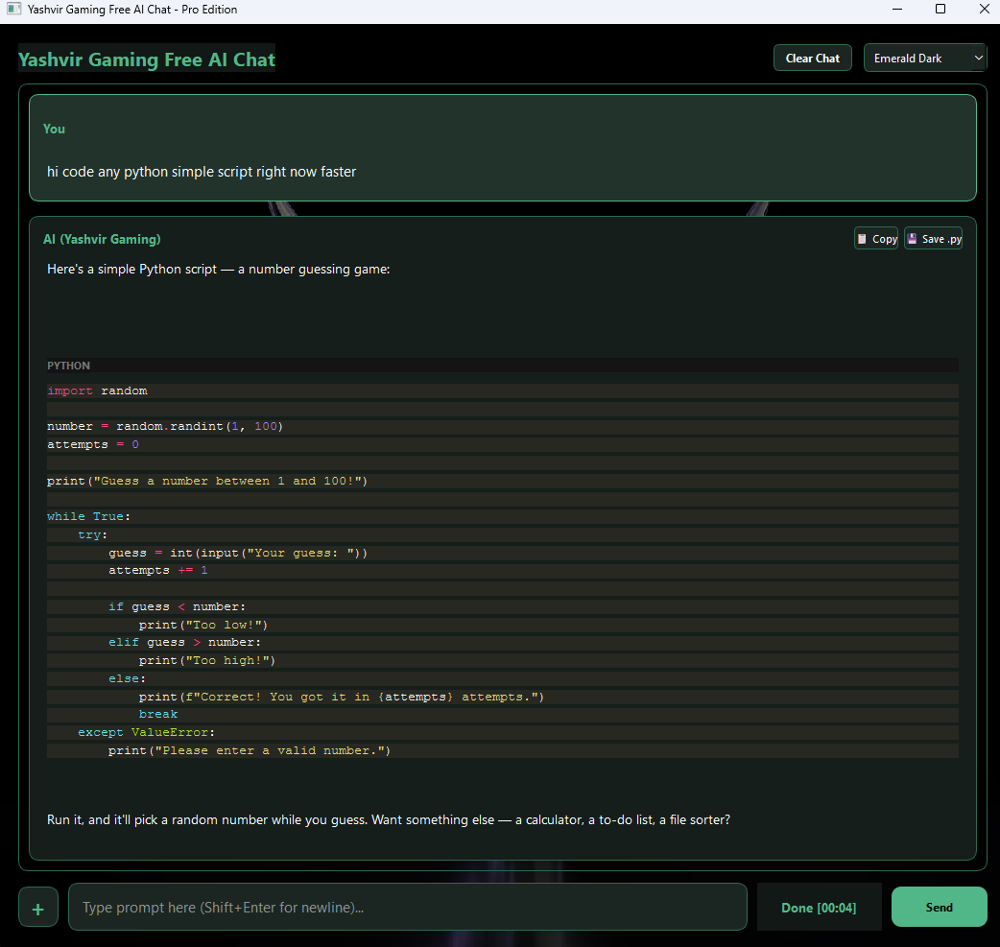
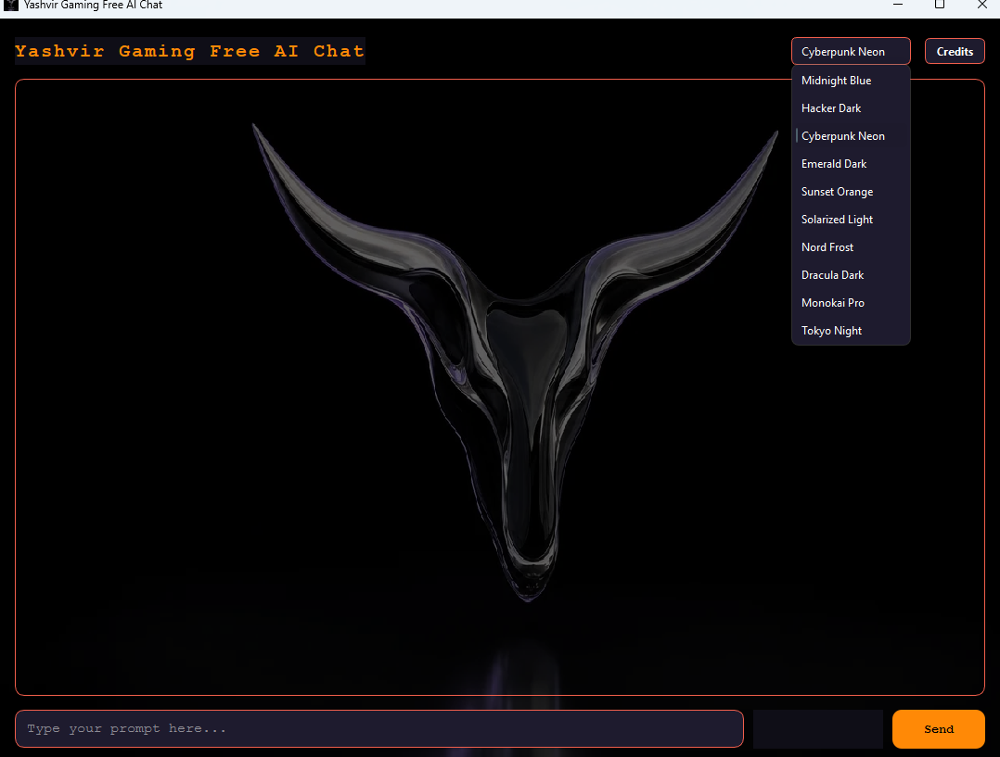
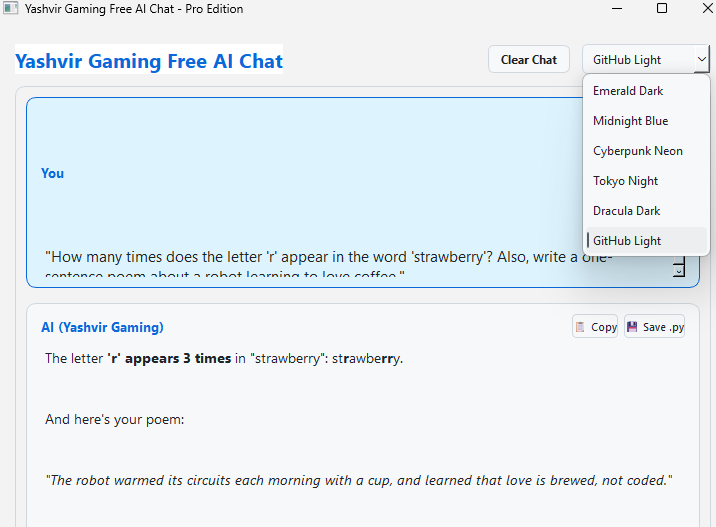
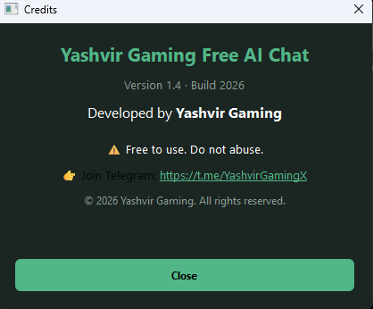

# YashvirGaming-AI
A powerful, feature-rich desktop AI chat assistant built with Python, PySide6, and Pygments, featuring VS Code-style syntax highlighting, full multi-turn conversation history, native file attachments, drag-and-drop support, and custom themes.

<div align="center">

# 🤖 Yashvir Gaming Free AI Chat — Pro Edition

<p>A high-performance, beautifully styled desktop AI assistant built in Python using PySide6 and httpx.</p>

<p>
  
  
  
  
</p>

</div>

---

## 📺 Video Showcase
<div align="center">
  <a href="https://www.youtube.com/watch?v=4bLtK0969kU" target="_blank">
    
  </a>
  <p><em>Click the image above to watch the full walkthrough on YouTube!</em></p>
</div>

---

## ✨ Pro Edition Features

* **Unlimited & Free Chat:** Powered via robust API streaming with zero restrictions or subscription walls.
* **Full Multi-Turn History Memory:** Remembers previous turns, context, code snippet changes, and names across entire conversations just like ChatGPT or Gemini.
* **VS Code-Style Syntax Highlighting:** Integrated **Pygments** rendering engine for clean keyword coloring (Python, JavaScript, HTML, C++, etc.) with Monokai and GitHub Light code themes.
* **One-Click Code Actions:**
  * 📋 **Copy Code:** Instantly copy formatted code blocks or full responses to clipboard.
  * 💾 **Save as Script:** Export code directly into `.py` or text files with one click.
* **Universal Drag & Drop & Plus Attachment Button (+):**
  * **Code & Text Files (`.py`, `.txt`, `.json`, `.js`, `.bat`, `.html`):** Automatically reads, extracts, and injects raw file contents into your prompt.
  * **Images (`.png`, `.jpg`, `.jpeg`, `.webp`, `.gif`):** Base64 converts and transmits image attachments directly for visual analysis.
* **Large Prompt Support (2K+ Characters):** Auto-resizing input box supporting multiline queries (`Shift + Enter` for new lines).
* **Mid-Generation Cancellation:** Swap the Send button into a "Stop" button to cancel generation mid-stream whenever needed.
* **Modern Desktop Themes:** Clean theme selector supporting high-contrast dark modes (Emerald Dark, Midnight Blue, Cyberpunk Neon, Tokyo Night, Dracula Dark, Catppuccin) and true light themes (GitHub Light).
* **Security Safeguards:** Process-level debugger/interceptor detection and automated CSRF/session token management.

---

## 📸 Screenshots

<div align="center">
  <p><b>Emerald Dark Theme</b></p>
  
</div>

<br>

<div align="center">
  <p><b>Cyberpunk Neon Theme</b></p>
  
</div>

<br>

<div align="center">
  <p><b>Active Chat & Syntax Highlighting</b></p>
  
</div>

<br>

<div align="center">
  <p><b>Credits Dialog</b></p>
  
</div>

---

## ⚙️ Installation & Usage

### 🚀 Direct Executable Download
Skip setting up Python environment—download the pre-compiled, standalone Windows executable directly from the official releases page:

👉 **[Download YashvirGaming-AI (Latest Release)](https://github.com/YashvirGaming/YashvirGaming-AI/releases/)**

---

### 💻 Run from Source (Optional)
If you prefer running or modifying the raw Python code directly:

```bash
git clone [https://github.com/YashvirGaming/YashvirGaming-AI.git](https://github.com/YashvirGaming/YashvirGaming-AI.git)
cd YashvirGaming-AI
pip install -r requirements.txt
python YashvirGamingAI.py
